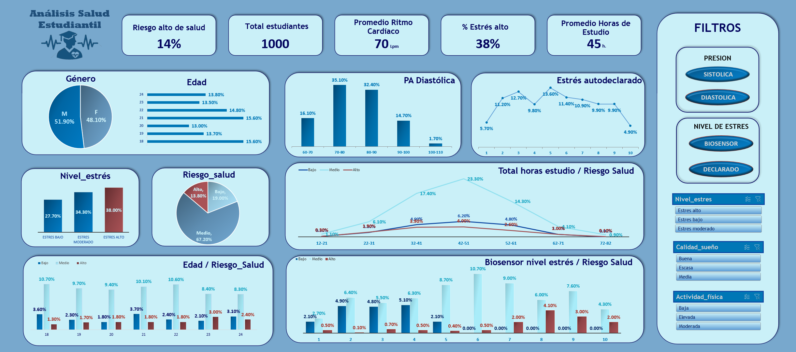

# Análisis_Salud_Estudiantil


<div style="text-align: center;">
 
</div>
Este proyecto analiza un conjunto de datos de estudiantes para explorar la relación entre factores como estrés, actividad física, calidad del sueño y estado emocional con distintos niveles de riesgo para la salud. El objetivo es identificar patrones y posibles correlaciones.


## Descripción del proyecto

## Estructura del proyecto

```bash
Analisis_Salud_Estudiantil/
│
├──Datos/ # carpeta con los archivos utilizados
│  │   
│  ├──Datos_Analisis/ #Carpeta con los archivos utilizados para analizar los datos
│  │  │
│  │  ├──Analisis_Descriptivo_categóricas_RiesgoSalud.xlsx
│  │  ├──Analisis_Descriptivo_numericas_RiesgoSalud.xlsx
│  │  └──Salud_Estudiantes_Analisis_Descriptivo.xlsx
│  │ 
│  ├──Datos_Dashboard/ # Carpeta con el Dashboard final
│  │  │
│  │  └── Dasboard.xlsm
│  │                       
│  ├──Datos_Primarios/ # Carpeta con los archivos originales
│  │  │
│  │  ├──student_health_data.csv
│  │  ├──Student_Health_Data.xlsx
│  │  └──Enlace_fuente_datos.txt 
│  │
│  └──Datos_Transformados/ # Carpeta con los datos transformados antes de su análisis
│     │
│     └──Transformación_Student_Health.xlsx
│ 
├──Descripción_del_Proyecto.docx # Documento explicativo del proyecto y las conclusiones.
│   
├──Img/ # Carpeta con loas imágenes utilizadas en el README-md
│  │
│  ├──portada.jpg
│  └──Dashboard.png
│
└──README.md

```

## Estructura de Datos

El archivo de datos original consta de varias columnas:

- **Student_ID**: Identificador único para cada estudiante.
- **Age**: Información sobre la edad de los estudiantes. 
- **Gender**: Información sobre el género de los estudiantes.
- **Heart_Rate**: Mediciones de ritmo cardíaco.
- **Blood_Pressure_Systolic**: Mediciones de Presion arterial Sistólica
- **Blood_Pressure_Diastolic**: Mediciones de Presion arterial diastólica.
- **Stress_Level_Biosensor**: Niveles de estrés medidos por biosensores en una escala del 1 al 10.
- **Stress_Level_Self_Report**: Niveles de estrés autodeclarados, en una escala del 1 al 10.
- **Physical_Activity**: Variable categórica que indican el nivel de actividad física (Low, Moderate, High)
- **Sleep_Quality**: Variables categóricas que indican el nivel de calidad de sueño (Poor, Moderate, Good).
- **Mood**: Estado emocional autodeclarado, categorizado como ‘Happy’, ‘Neutral’ o ‘Stressed’.
- **Study_Hours**: Horas semanales dedicadas al estudio.
- **Project_Hours**: Horas semanales de estudio complementario y prácticas.
- **Health_Risk_Level**: Etiqueta objetivo derivada de los indicadores de estrés y estilo de vida, categorizada como Low, Moderate, o High risk.


## Desarrollo del proyecto

### 1. Parte

- Entendimiento general del conjunto de datos y de las columnas.

### 2. Parte

- Establecimiento del tipo de datos, normalización de los datos.

### 3. Parte

- Análisis descriptivo de las columnas numéricas.

### 4. Parte

- Análisis descriptivo de las columnas categóricas.

### 5. Parte

- Análisis descriptivo de las columnas numéricas y la columna objetivo.

### 6. Parte

- Análisis descriptivo de las columnas categóricas.

### 7. Parte

- Creación de una nueva columna.

### 8. Parte

- Eleccion de las columnas relevantes para el dashboard.

### 9. Parte

- Creación del dashboard.

### 10. Parte

- Resúmen y conclusiones.


## Dashboard

<div style="text-align: center;">
 
</div>

## Conclusiones

- Estrés y riesgo de salud: Existe una relación clara entre altos niveles de estrés y un mayor riesgo de salud. Para mitigar estos efectos, sería útil implementar técnicas de control del estrés y apoyo psicológico.

- Calidad del sueño y bienestar: Una mala calidad del sueño está asociada con un mayor riesgo de salud. Mejorar los hábitos de descanso, como evitar pantallas antes de dormir y mantener hábitos alimenticios regulares, puede reducir este riesgo.

- Carga de estudio y salud: Atendiendo a los datos suminitrados, no hay evidencia de que más horas de estudio afecten el riesgo de salud, pero un equilibrio entre estudio y descanso ayuda a evitar el estrés.

- Actividad física y salud: Aunque el ejercicio es beneficioso, el exceso puede aumentar el riesgo de salud. Mantener una actividad moderada y evitar sobreentrenamientos es clave.

- Estado emocional y bienestar: Los estudiantes con un estado emocional neutral presentan menor riesgo de salud. Promover el equilibrio emocional puede ser clave para mejorar el bienestar.

- Ampliar los datos sobre ritmo cardíaco y presión arterial permitiría un análisis más profundo de su relación con el riesgo de salud.

## Fuente de datos

https://www.kaggle.com/datasets/ziya07/student-health-data


## Contribuciones

Si tienes alguna propuesta o corrección, no dudes en compartirla. Cualquier tipo de colaboración, ya sea en forma de código, documentación o comentarios, será apreciada y considerada. ¡Gracias por tu participación!

## Autor

- Victor - [GitHub Profile](https://github.com/Vic-tor123)

